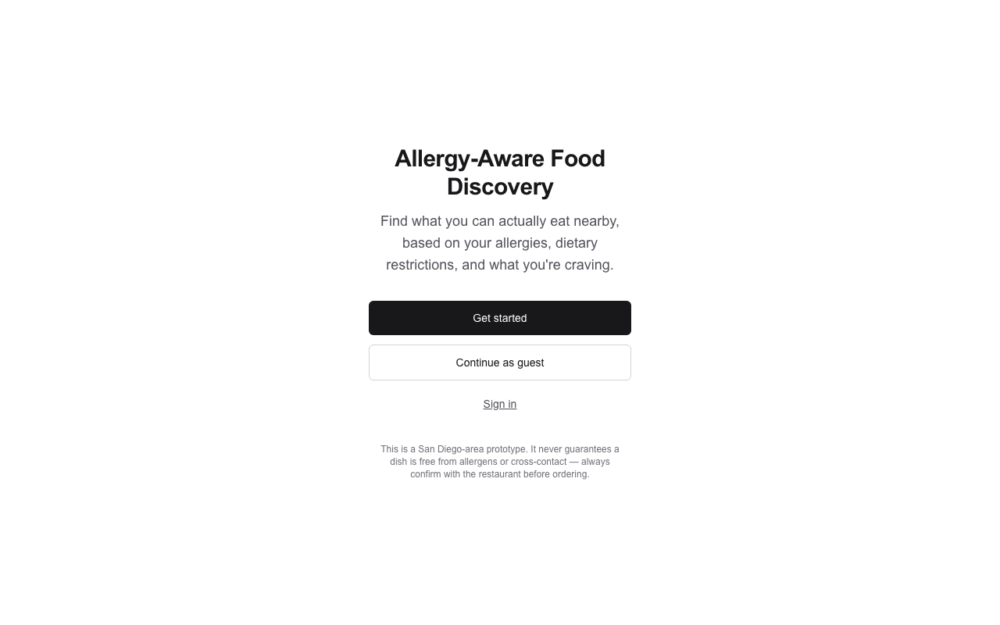
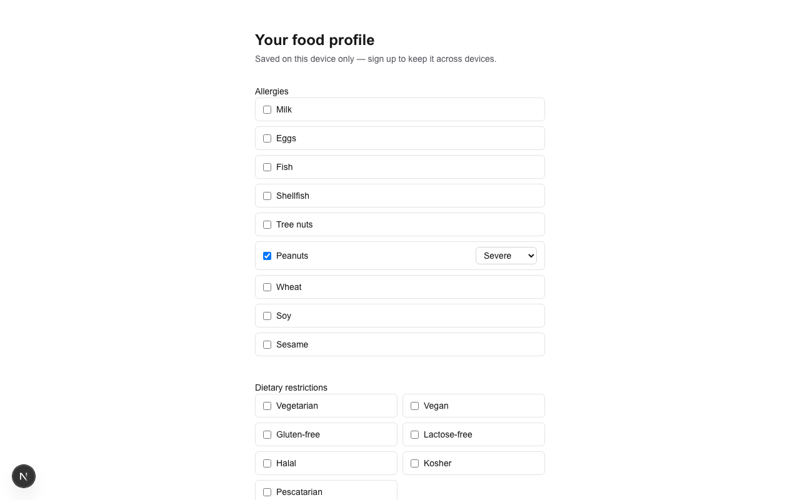
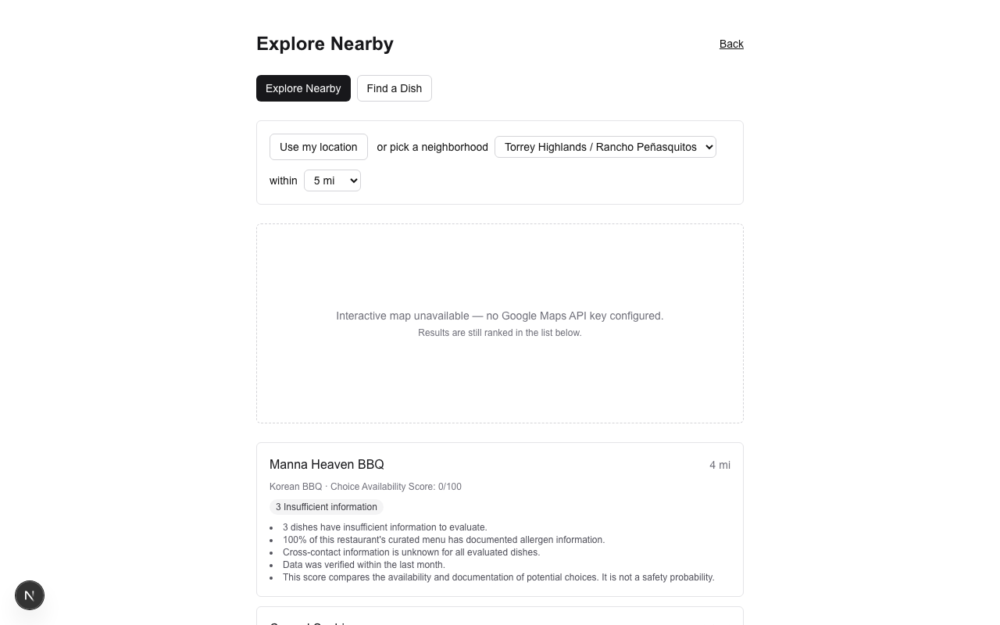
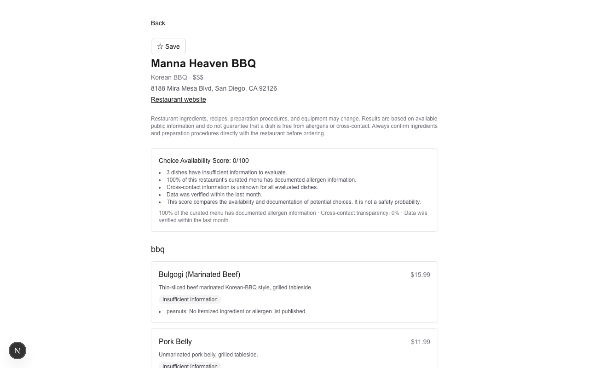
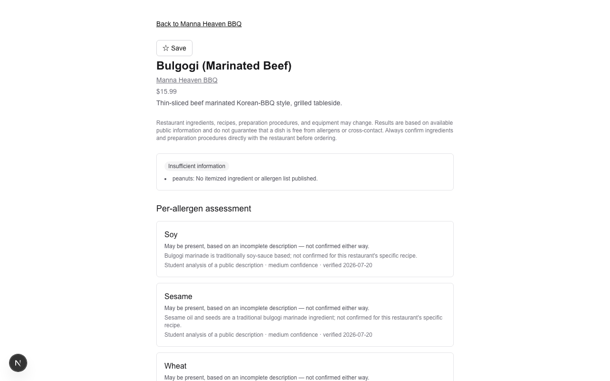
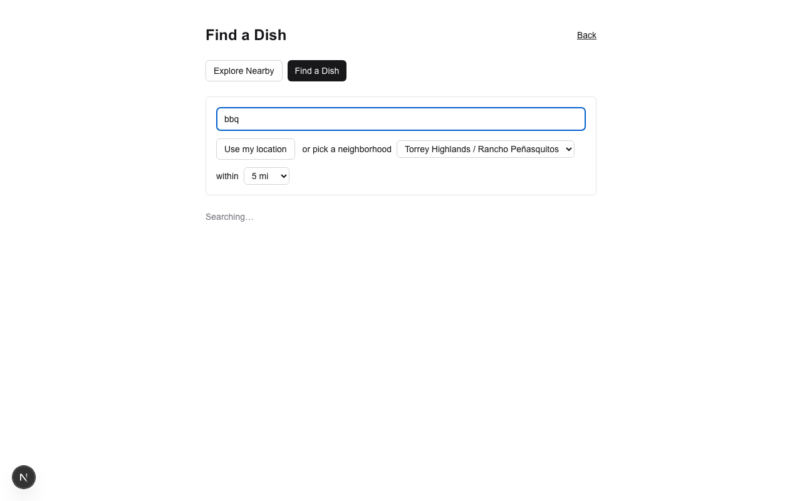
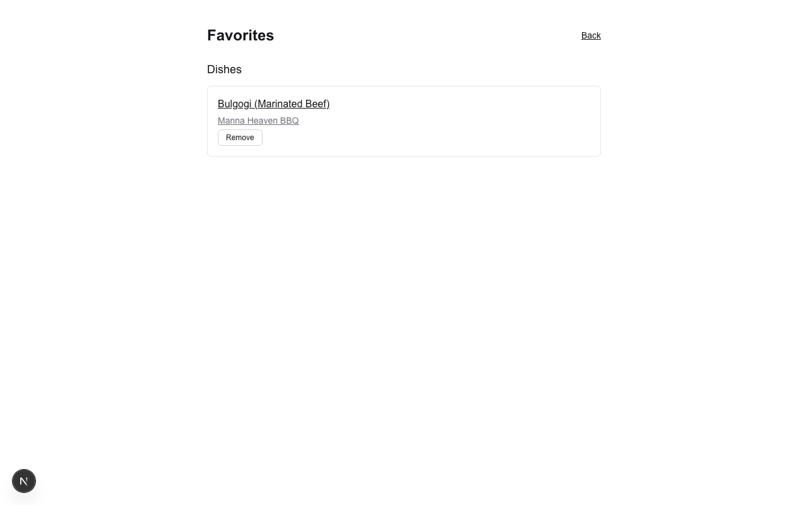

# ClearPlate — Allergy-Aware Food Discovery

A 2026 Congressional App Challenge submission.

> Built and submitted as part of the 2026 Congressional App Challenge. See `AI_USAGE.md` for the full AI-assistance disclosure.

## Purpose

Helps people with food allergies and dietary restrictions answer a more useful question than "what restaurants are near me?" — namely, **"what can I actually eat nearby, based on my allergies, dietary restrictions, and current craving?"**

Instead of a single "allergy-friendly" label, the app ranks restaurants and individual dishes using personalized compatibility, evidence reliability, data freshness, available modifications, and cross-contact transparency — and explains every recommendation. It never claims a dish is guaranteed safe.

## Target audience

People managing food allergies or dietary restrictions (and their families) searching for compatible dining options in the San Diego area covered by this prototype.

## Features

- Save an allergy profile (allergen + severity/matching strictness) and dietary restrictions
- Guest mode — try the full app without creating an account
- **Explore Nearby** — location + radius search, restaurants ranked by a Choice Availability Score
- **Find a Dish** — search a craving (e.g. "spicy fried rice") and get matching/related dish results
- Restaurant detail pages with categorized menu items and a full score explanation
- Dish detail pages showing per-allergen evidence, confidence level, source, and last-checked date
- Cross-contact transparency (shown only when a source documents it, otherwise explicitly marked unknown)
- Auto-generated, personalized questions to ask restaurant staff
- Favorites

## Technology stack

- **Framework:** Next.js 16 (App Router), JavaScript
- **Styling:** Tailwind CSS 4
- **Database / Auth:** Supabase (Postgres, Auth, Row Level Security)
- **Map:** Leaflet + OpenStreetMap (client-side rendering only, free, no API key)
- **Testing:** Vitest
- **Deployment:** Vercel + Supabase
- **AI development assistant:** Claude (see `AI_USAGE.md`)

## Installation

```bash
npm install
cp .env.example .env.local   # then fill in real values, see below
npm run dev
```

Open http://localhost:3000.

## Environment variables

See `.env.example` for the full list with inline explanations. Summary:

| Variable | Where it's used | Exposed to browser? |
|---|---|---|
| `NEXT_PUBLIC_SUPABASE_URL` | Supabase client | Yes |
| `NEXT_PUBLIC_SUPABASE_ANON_KEY` | Supabase client (protected by RLS, not secrecy) | Yes |
| `SUPABASE_SERVICE_ROLE_KEY` | Seed scripts only | No — server-side only |
| `NEXT_PUBLIC_GOOGLE_MAPS_API_KEY` | Map rendering (restricted by HTTP referrer + API scope) | Yes, by design |

## Startup / scripts

```bash
npm run dev      # local dev server
npm run build    # production build
npm run start    # run a production build locally
npm run lint     # ESLint
npm test         # Vitest unit tests for /src/lib
```

Seeding the curated dataset into Supabase (once Phase 3 data exists):

```bash
node scripts/seed-restaurants.js
node scripts/seed-menu-data.js
```

## Deployment

Deployed on Vercel from the production branch of this repository, with the database/auth hosted on Supabase. Live URL: _TBD_. A guest/demo mode means judges do not need credentials to evaluate the app.

## Screenshots

| | |
|---|---|
|  |  |
|  |  |
|  |  |
|  | |

## Project structure

```
/src/app        Next.js App Router pages and API route handlers
/src/components React components
/src/lib        Deterministic, unit-tested logic: classification, scoring,
                evidence, question generation, search
/scripts        One-time data-seeding scripts
/data/seed      Curated restaurant/menu source data
/tests          Vitest unit tests
/docs/screenshots  README screenshots
```

## Known limitations

Full detail in `LIMITATIONS.md`. In short: this is a scoped prototype (~15–30 San Diego restaurants, ~100–300 menu items), not a nationwide production app, and it never guarantees allergen safety — it shows evidence, confidence, and what to confirm with the restaurant.

## AI disclosure summary

AI tools, including Claude, were used as a development assistant during this project — supporting brainstorming, technical explanations, starter-code generation, debugging, interface suggestions, testing, and documentation drafting. The student made the final product, architecture, data-model, safety, and user-experience decisions; reviewed and modified AI-generated code; implemented and tested the application; developed the personalized matching and ranking logic; curated the restaurant and allergen data; and maintained the AI-use record in `AI_USAGE.md`. Full detail there.

## Disclaimer

Restaurant ingredients, recipes, preparation procedures, and equipment may change. Results are based on available public information and do not guarantee that a dish is free from allergens or cross-contact. Always confirm ingredients and preparation procedures directly with the restaurant before ordering.
